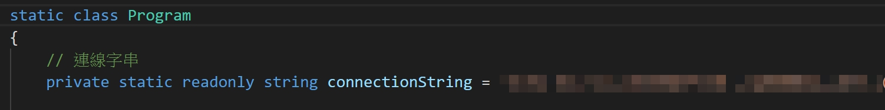
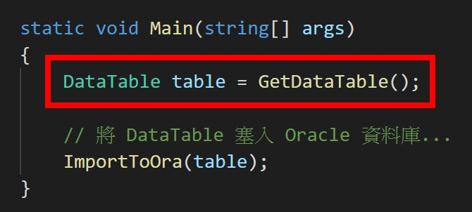

# OracleBulkCopy.Demo
> 這個專案專注於實作 Oracle BulkCopy。  
> This project focus on implement oracle version bulk copy.  

練習使用 Oracle.ManagedDataAccess 元件實作出 Oracle BulkCopy。  
To practice how use of Oracle.ManagedDataAccess component implement oracle version bulk copy.  

## 運行專案
> 調整你想要的 connectionString 變數。
1. Modify connectionString variable you want.  

> 創造一個你想要的 DataTable 資料。
2. Create DataTable data you want.  

> 接著透過 Visual Studio 2019 或者利用 `dotnet run` 指令把專案跑起來。  
3. Then run the project from Visual Studio 2019 or by typing `dotnet run` in a command window.  

## 最後版本
1.0.0.0 (May 12, 2020)

## 記錄
* 1.0.0.0
  * Initial Commit (初次上版)

## 參考文章
* Chinese
  * [Managed ODP.NET 高速 INSERT 資料](https://blog.darkthread.net/blog/managed-odpnet-array-binding)